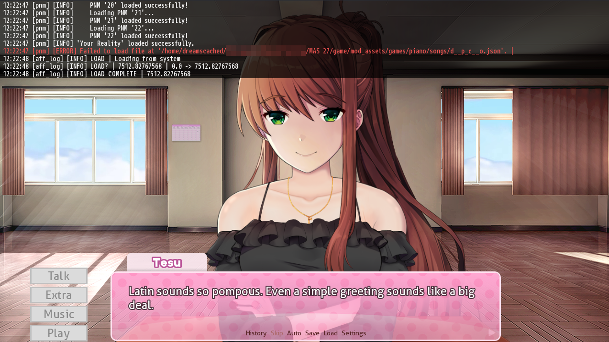
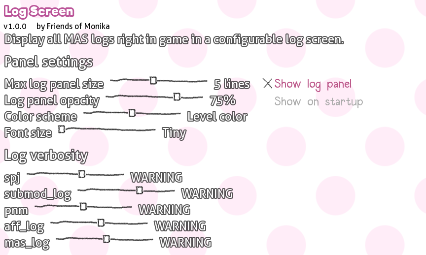

	<!--  -->
	<h1 align="center">📜 Log Screen Submod 📜</h1>
	<h3 align="center">Read all MAS logs right in game with a configurable log panel</h3>

	
	
	
	
	

## 🌟 Features

* Easy to configure dropdown log panel (with a keybind on <kbd>L</kbd>)
* Configurable log verbosity/severity levels for each logger
* Log message colors based on logger or severity

## 🖼️ Screenshots

	
Click here to see all screenshots...

	<table>
		<tr>
			<td></td>
			<td></td>
		</tr>
	</table>

<!-- Generic installation guide that works for .zip packages built by scripts of this template. -->
## ❓ Installing

1. Go to [the latest release page](https://github.com/Friends-of-Monika/mas-logscreen)
   and scroll to Assets section.
2. Download `log-screen-1.0.0.zip` file.
3. Drag and drop `Submods` folder from it into your `game` folder. When your OS
   asks you if you want to merge folders, merge them.
4. You're all set!~

## 💬 Join our Discord

We're up to chat! Join our Discord server [here](https://mon.icu/discord).

